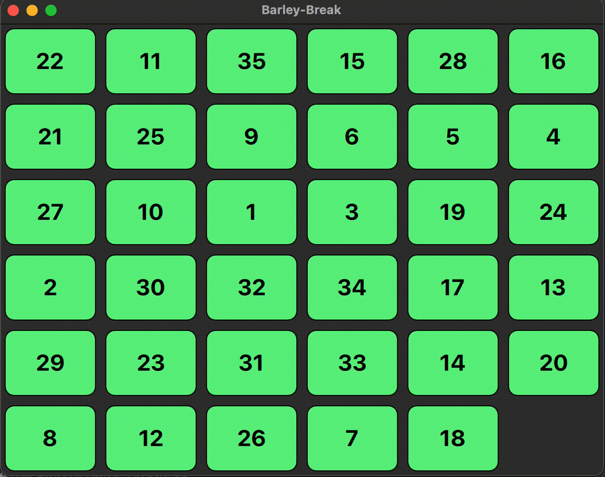

# BarleyBreak in Qt/QML



BarleyBreak is a classic English country game mentioned in literature and played during the 17th and 18th centuries. This repository provides an implementation of the BarleyBreak game using Qt6 Quick.

## Game Description

BarleyBreak is played by three pairs, each consisting of a man and a woman, who are stationed in three bases or plots that are contiguous to each other. The objective of the game is for the couple occupying the middle base, known as "hell" or "prison," to catch the other two couples. When chased, the couples being pursued can break away to avoid being caught. If one couple is overtaken, both members of that couple are condemned to "hell." The game's name is derived from this gameplay mechanic.

## Features

- Classic BarleyBreak gameplay
- Interactive and intuitive user interface
- Randomized initial puzzle layout
- Real-time tracking of game progress

## Dependencies

To build and run the BarleyBreak project, you need to have the following dependencies installed:

- CMake 3.15 or above
- Qt6 6.2 with the Quick module

## Build Instructions

Follow these steps to build the BarleyBreak project:

1. Clone this repository to your local machine.
2. Navigate to the project directory.
3. Run the following commands:

```bash
cmake -S . -B ./build
cmake --build ./build
```

4. The executable for BarleyBreak will be generated in the `build` directory.

## Usage

To play BarleyBreak, simply run the generated executable. The game will launch with a randomized initial puzzle layout. Use the arrow keys or swipe gestures (if supported) to move the tiles and rearrange them in ascending order.


## License

This project is licensed under the MIT License. See the [LICENSE](LICENSE) file for details.
